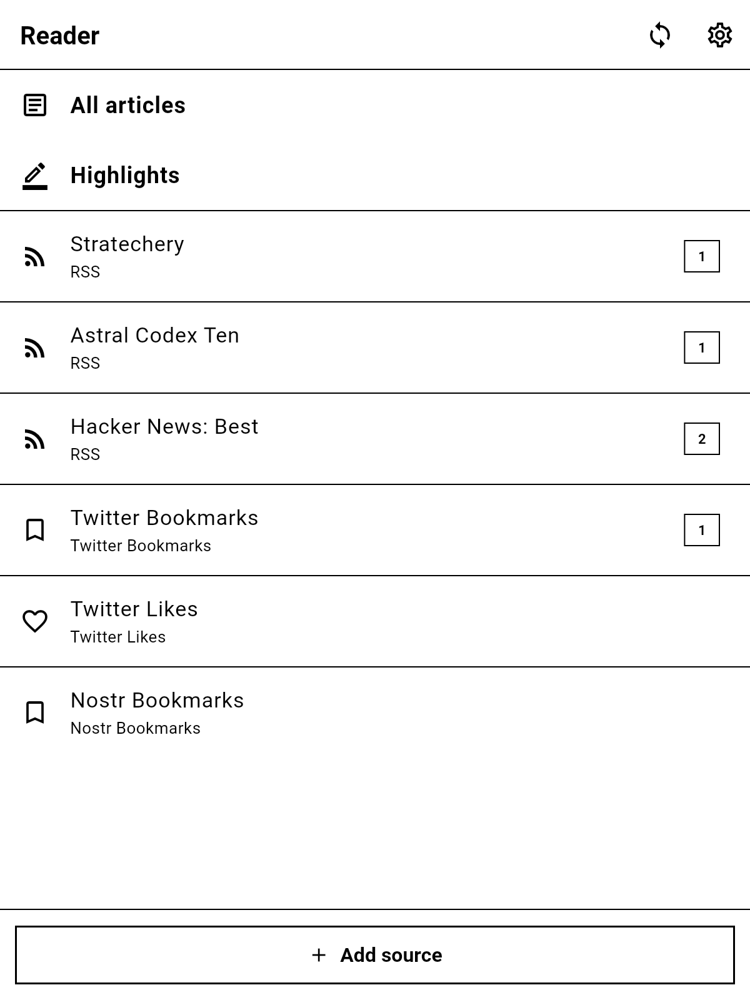
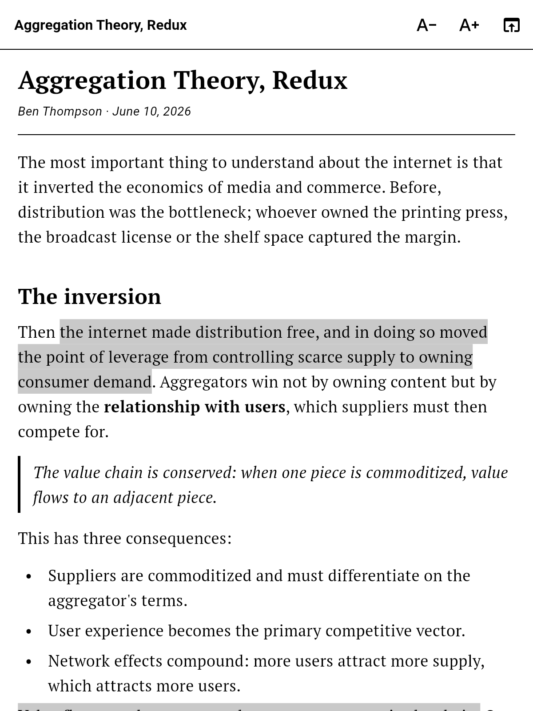
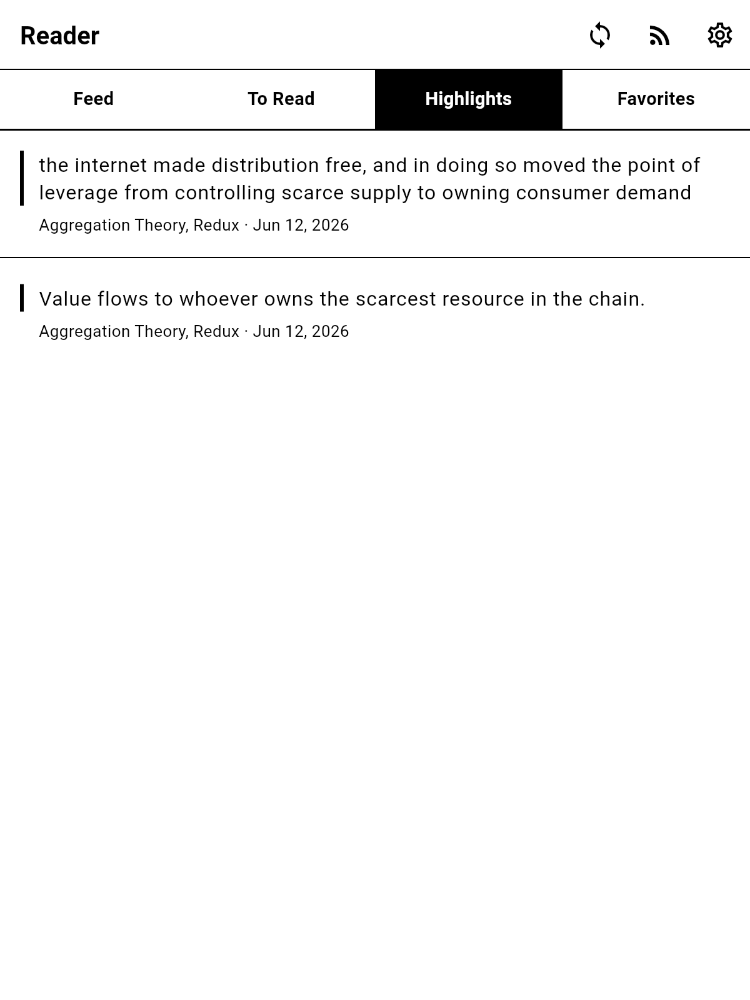

# einkreader

A minimal, offline-first reader for **e-ink tablets** (and regular phones/tablets), built with Flutter for **iOS and Android**.

It pulls articles from:

- **RSS / Atom feeds** you add (paste a feed URL or just a website address — the feed is auto-discovered),
- **Twitter / X** via OAuth: two feeds, one for your **Bookmarks** and one for your **Likes**,
- **Nostr** with nothing but your public key (**npub**): your public **bookmark list** (NIP-51, kind 10003) and your **likes** (NIP-25 reactions).

Everything is downloaded while you're online and stored locally in SQLite, so the whole library reads fine offline.

## Download

**[⬇️ Download the latest Android APK](https://github.com/xdamman/einkreader/releases/latest)** — grab the `einkreader-*.apk` asset from the most recent release, copy it to your e-ink tablet (or phone) and open it to install.

You may need to allow "install from unknown sources" the first time. The APK is built and published automatically by [GitHub Actions](.github/workflows/release.yml) on every tagged release, and is signed so that older/locked-down e-ink firmwares (which reject v2/v3-only signatures) accept it.

> iOS has no public build — Apple requires installs signed with your own Apple ID. Build it yourself with `flutter build ios` (see [Building](#building)).

## Screenshots

| Home | Reader (with highlights) | Highlights |
|---|---|---|
|  |  |  |

More in [`docs/screenshots/`](docs/screenshots/), including phone-sized variants. They are generated from the real widgets — no emulator needed — by the golden test in `test/screenshots/`:

```bash
flutter test test/screenshots/screenshot_test.dart \
  --update-goldens --dart-define=screenshots=true
```

## How content is prepared

When a feed already ships the full article (`content:encoded`), it is converted straight to Markdown. Otherwise the linked page is downloaded and run through an on-device readability-style extractor + HTML→Markdown converter (`html2md`) — a lightweight pandoc equivalent. Tweets and Nostr notes that link to an article get the original post quoted above the extracted article.

## Highlights

Long-press to select any text in the reader and choose **Highlight** in the selection menu. Highlights are:

- painted inline (grey wash — renders well on e-paper) every time you reopen the article,
- collected in the **Highlights** screen, newest first, each linking back to its article,
- removable with a long-press.

## E-ink optimizations

- Pure black on pure white, no greys in the chrome, 1px borders instead of shadows.
- **No page transition animations**, no ripples, no splash effects (these smear/ghost on e-paper).
- Serif reading font, adjustable text size, capped line length on tablets.
- Unread items are bold; counters are plain outlined boxes.

## Building

```bash
flutter pub get
flutter run            # on a connected device/simulator
flutter build apk      # Android
flutter build ios      # iOS (requires Xcode + signing)
flutter test           # unit tests for parsers/extractor
```

## Connecting Twitter / X

The app uses OAuth 2.0 with PKCE (a *public* client — no secret is embedded or needed). You bring your own client ID:

1. Create a (free) app at [developer.x.com](https://developer.x.com).
2. In *User authentication settings* choose **Native app / public client**, and set the callback URL to exactly:
   `einkreader://callback`
3. Requested scopes: `tweet.read users.read bookmark.read like.read offline.access`.
4. Copy the **OAuth 2.0 Client ID** into *Settings → Twitter / X* in the app and tap **Connect Twitter**.

This creates the *Twitter Bookmarks* and *Twitter Likes* sources. Tokens are kept in the platform secure storage (Keychain / Keystore) and refreshed automatically.

> Note: the free X API tier is heavily rate-limited; if a sync reports a rate limit, just sync again later.

## Connecting Nostr

Paste your `npub1…` into *Settings → Nostr*. Only the public key is used — never a private key. The app queries a few public relays (`relay.damus.io`, `nos.lol`, `relay.nostr.band`) for your bookmark list and recent likes, resolves the referenced notes, and downloads any linked articles for offline reading.

## Syncing

Sources refresh automatically on launch, and on demand via the sync button. A sync:

1. updates every source (RSS, Twitter, Nostr),
2. downloads the full content of every new article that needs it,
3. stores everything locally for offline reading. Articles that fail to download (offline, paywall) are retried on the next sync.

## Project layout

```
lib/
  models.dart                 # Source / Article / Highlight
  theme.dart                  # e-ink theme (no animations, B&W)
  db/app_database.dart        # SQLite storage
  services/
    feed_parser.dart          # RSS 2.0 + Atom parser
    extractor.dart            # readability-style HTML → Markdown
    twitter_service.dart      # OAuth2 PKCE + bookmarks/likes API
    nostr_service.dart        # npub decode + relay queries
    sync_service.dart         # source refresh + offline downloads
  widgets/markdown_view.dart  # Markdown renderer with inline highlights
  screens/                    # home, article list, reader, highlights,
                              # add source, settings
```
